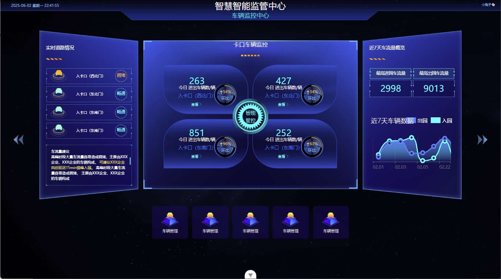

# Central-Monitor-Flex | 数据大屏解决方案  

       

**企业级数据可视化大屏，支持动态轮询、自动适配、高保真UI还原**  

## 🌟 核心功能  

- **5大动态页面**：停车场、数据分析、大数据、社区、经营监管  
- 登录页（UI无登录逻辑）：`/login`
- **智能屏幕适配**：  
  - 支持 `postcss-px-to-viewport`（精准vw单位）  
  - 支持 `autofit`（百分比缩放，兼容不同分辨率）  
- **高性能轮询**：  
  - 全接口Mock（`vite-plugin-fake-server`）  
  - 1秒级数据刷新
- **图表黑科技**：  
  - 饼图自动轮播高亮（无感hover效果）  
  - ECharts动态渲染优化  

### **📌 大屏项目核心功能总结**  

✅ **5大页面**（Vue3 + ECharts + 轮询Mock数据）  
- **登录页**（无逻辑，纯UI）  
- **主页**（导航跳转：停车场、数据分析、大数据、社区、经营监管）  
- **停车场**（动态数据刷新）  
- **数据分析**（饼图轮播 + 自动高亮）  
- **大数据**（动态图表）  
- **社区**（动态数据）  
- **经营监管**（静态页面）  

✅ **关键技术点**  
- **屏幕适配**：支持 `postcss-px-to-viewport-8-plugin`（vw方案）和 `autofit`（百分比缩放）  
- **数据Mock**：`vite-plugin-fake-server` 模拟动态接口（GET请求，1秒刷新）  
- **图表交互**：  
  - 饼图自动轮播高亮（`dispatchAction` 控制 `highlight/downplay`）  
  - 所有图表（除经营监管）支持实时刷新  

## 🛠️ 技术栈  
| 领域     | 技术选型                                                     |
| -------- | ------------------------------------------------------------ |
| 前端     | Vue3 + Pinia + ECharts + Web Workers（数据压缩）             |
| 后端模拟 | vite-plugin-fake-server（零成本Mock）                        |
| 工程化   | Vite + GitLab CI/CD（Docker镜像自动构建）                    |
| 适配方案 | postcss-px-to-viewport-8-plugin / autofit.js（双模式可切换） |

## 🎬 智能路由动画系统  
### 特性  
- **开箱即用**：全局默认淡入淡出动画（`animate.css`驱动）  
- **灵活覆盖**：支持页面级定制动画效果（如弹跳、缩放等）  
- **零性能损耗**：`animate__faster`模式+`mode="out-in"`防止渲染冲突  

✅ **精细化路由动画控制**

- 默认全局动画：`fadeInLeft/fadeOutLeft`（平滑渐进）
- 支持页面级定制：通过`route.meta.transition`覆盖默认效果（如案例中的`bounceInUp`）
- 性能优化：`animate__faster`强制开启硬件加速，避免页面切换卡顿

✅ **开发者友好设计**

```javascript
// 任意路由快速配置动画  
meta: {
  transition: {
    enter: 'animate__zoomIn',  // 进入动画  
    leave: 'animate__zoomOut' // 离开动画  
  }
}
```

### 如何使用？  
1. **全局默认动画**：无需配置，自动生效  
2. **自定义动画**：在路由中定义`meta.transition`  
```ts
{
  path: '/your-route',
  meta: {
    transition: {
      enter: 'animate__zoomIn',  // 进入效果  
      leave: 'animate__zoomOut' // 离开效果  
    }
  }
}
```

**动画库扩展**：直接使用[animate.css官方类名](https://animate.style/)

## 📸 效果预览  

| 主页                                                         | 数据分析                                       |
| ------------------------------------------------------------ | ---------------------------------------------- |
|  |  |




## 🚀 快速启动  

```bash  
# 开发模式（autofit适配）  
npm run dev  

# 生产构建（vw适配）  
VITE_POST_CSS_PX_TO_VIEWPORT8_PLUGIN=true npm run build  
```

## 🤔 技术决策  
### 为什么选择轮询而非WebSocket？  
- **业务适配**：数据更新频率为1秒/次，轮询足够且更稳定  
- **企业兼容性**：部分内网禁用WebSocket，轮询通用性更强  
- **扩展性**：代码预留WebSocket升级接口（`/src/libs/ws.ts`）  

## 📈 性能优化  
- **轮询防抖**：避免频繁请求导致内存泄漏  
- **ECharts实例池**：复用图表DOM节点  

## 📜 开源协议  
MIT License 